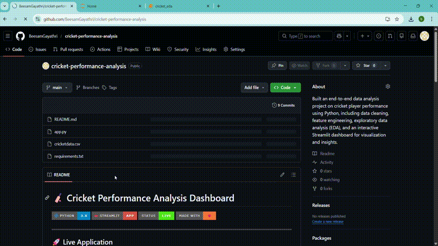

# 🏏 Cricket Performance Analysis Dashboard


---

## 🚀 Live Application

🌐 **https://cricket-performance-analysis.streamlit.app/**

---

## 🎯 Project Impact

This project demonstrates an **end-to-end data analysis workflow**, transforming raw cricket data into actionable insights.

✔️ Data Cleaning & Preprocessing
✔️ Exploratory Data Analysis (EDA)
✔️ Data Visualization & Storytelling
✔️ Deployment of a Live Interactive Dashboard

💡 Built to help users quickly analyze player performance and identify trends.

---

## 📌 Features

✨ Interactive Dashboard
✨ Player Search Functionality
✨ Country-Based Filtering

### 📊 Key Metrics:

* 🏏 Total Runs
* 📊 Batting Average
* ⚡ Strike Rate

✨ Clean UI & smooth user experience

---

## 🛠️ Tech Stack

| Category      | Tools               |
| ------------- | ------------------- |
| Language      | Python 🐍           |
| Framework     | Streamlit 🌐        |
| Data Analysis | Pandas, NumPy       |
| Visualization | Matplotlib, Seaborn |

---

## 📂 Project Structure

```bash id="8sv7jp"
cricket-performance-analysis/
│
├── app.py
├── cricketdata.csv
├── requirements.txt
└── README.md
```

---

## 📊 Insights Generated

✔️ Identify top-performing players
✔️ Compare performance across countries
✔️ Analyze aggressive vs consistent players
✔️ Discover trends in batting performance

---

## 🚀 Run Locally

```bash id="x4nbqv"
git clone https://github.com/BeesamGayathri/cricket-performance-analysis.git
cd cricket-performance-analysis
pip install -r requirements.txt
streamlit run app.py
```

---

## 🔮 Future Enhancements

🚀 Player vs Player comparison
🤖 Machine Learning predictions
🌙 Dark mode UI
📥 Export/download reports

---

## 👩‍💻 Author

**Gayathri Beesam**
🎯 Aspiring Data Analyst
💡 Passionate about data analysis and visualization

---

## 🔗 Connect With Me

* 💼 LinkedIn: https://linkedin.com/in/beesam-gayathri
* 📂 GitHub: https://github.com/BeesamGayathri

---
## 🎥 App Demo  

<p align="center">
  
</p>

<p align="center">
  <b>🏏 Cricket EDA Dashboard – Data Analysis & Insights Visualization</b>
</p>
---
## ⭐ Support

If you like this project, please ⭐ the repository and share it!
